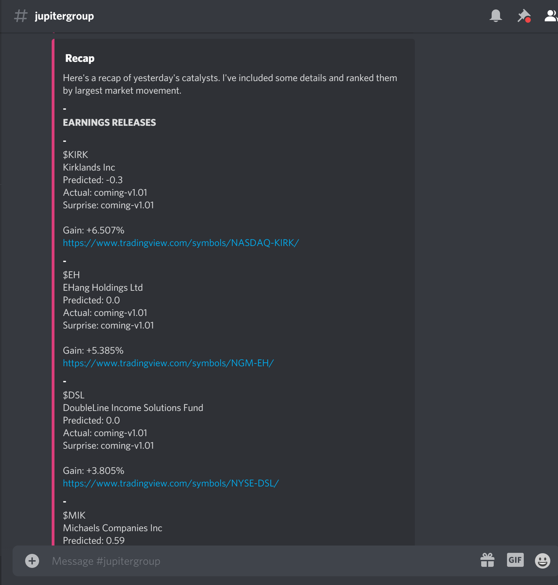
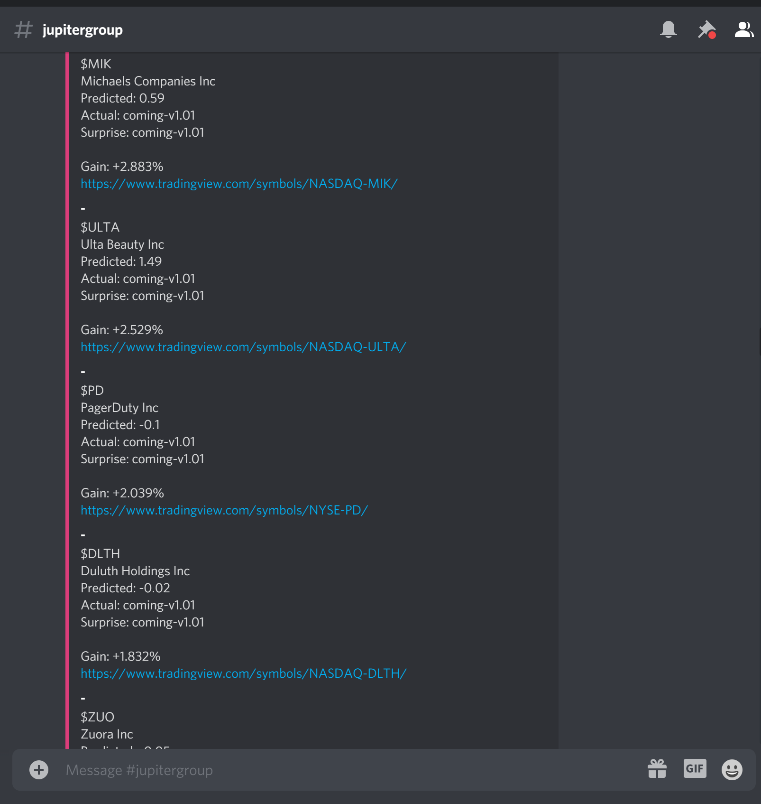
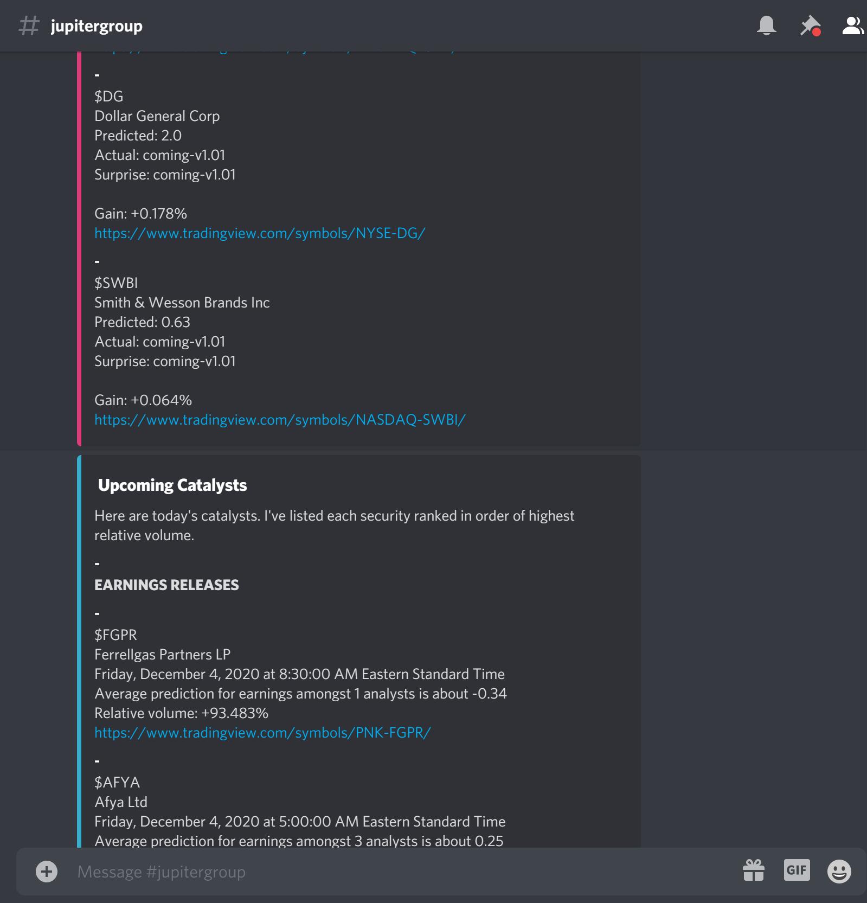
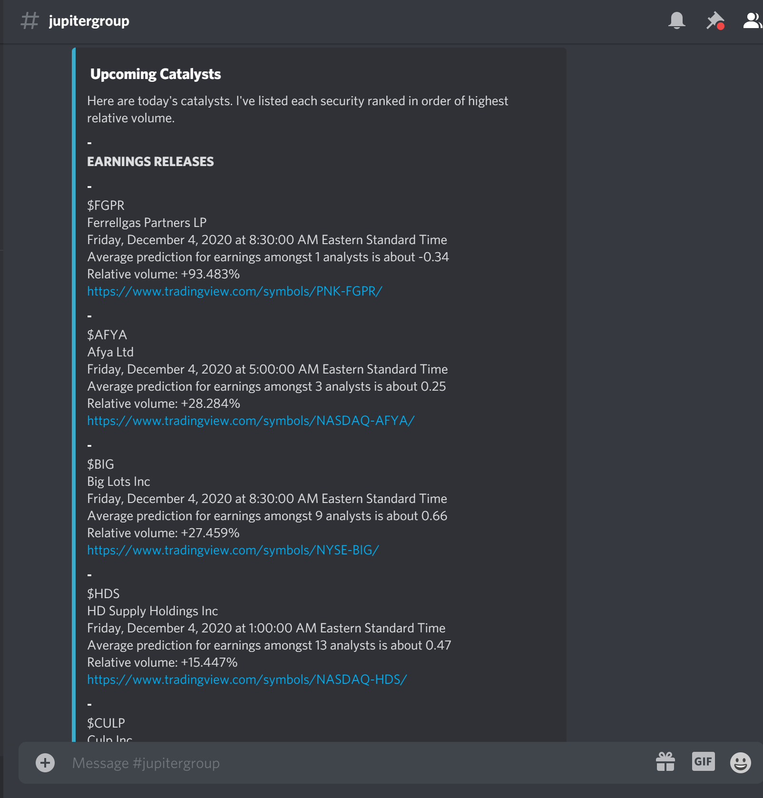
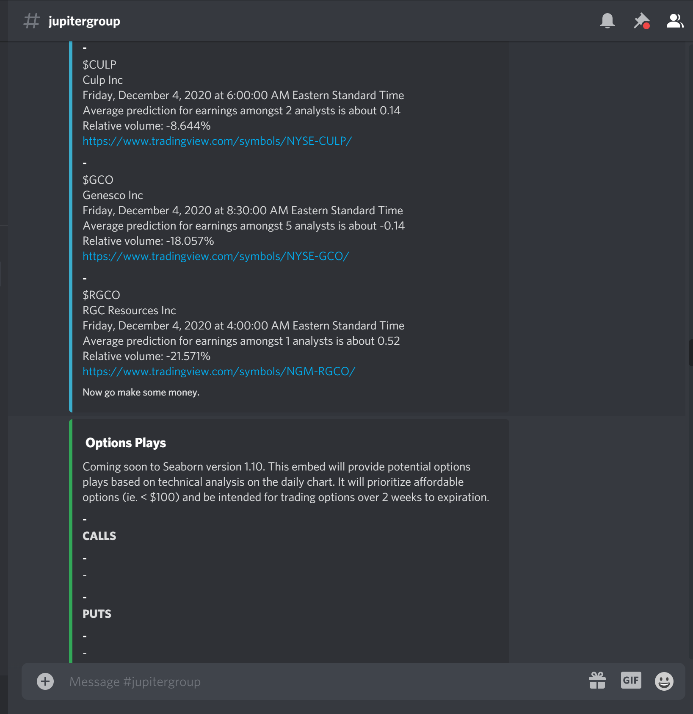

# Seaborn

Designed to relay information about company's earnings reports to a Discord server.

You can see we made use of the NetDv8tion API (provided by Discord) to communicate with the 
Discord chat, and we are using Yahoo Finance API data to get earnings reports and company information.

____

This is an old project, but it's still a useful early attempt at stock market data technology.

**Check out some of my newer projects to see how I've built on projects like this one.**
____

